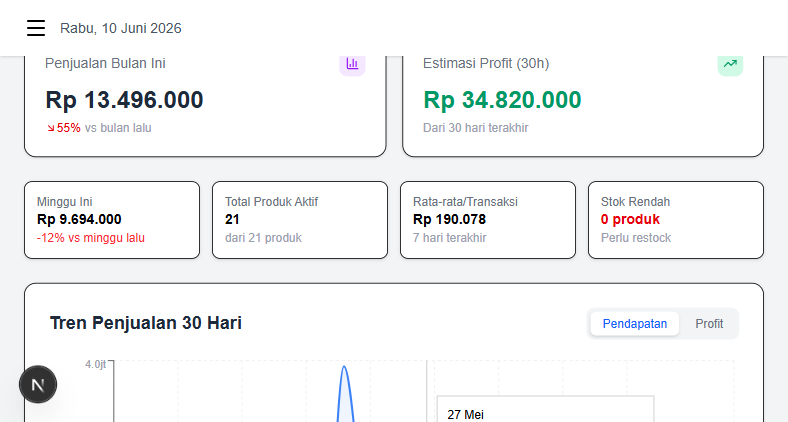
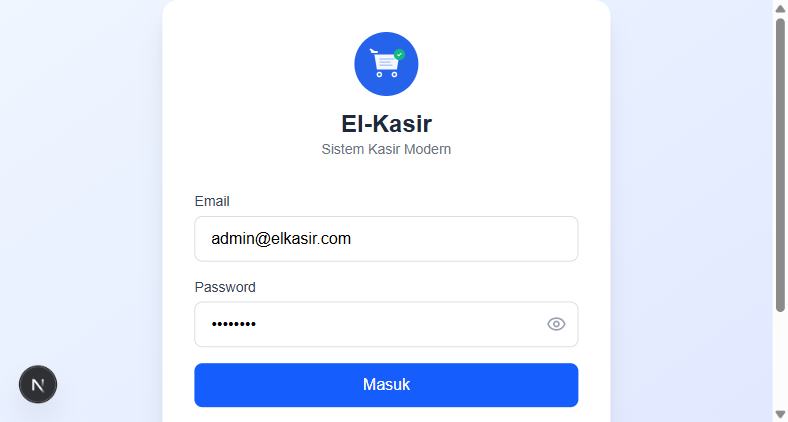
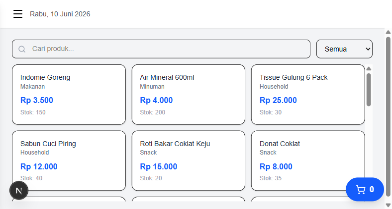
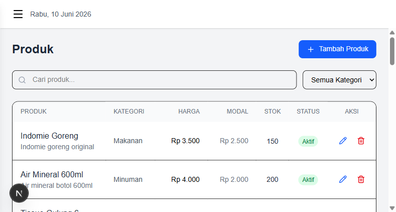
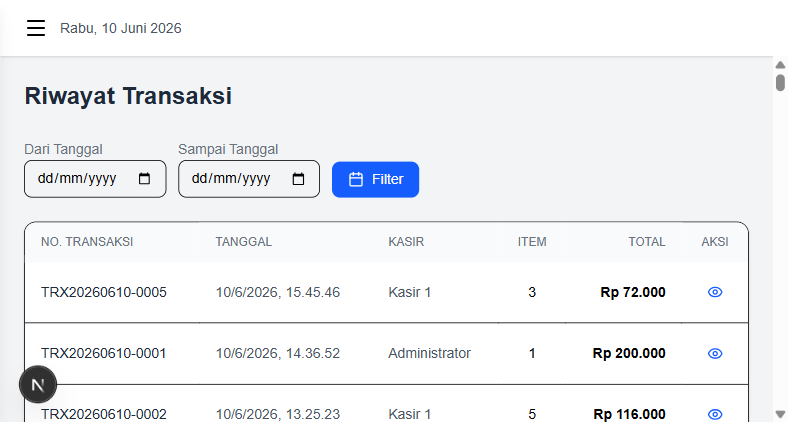
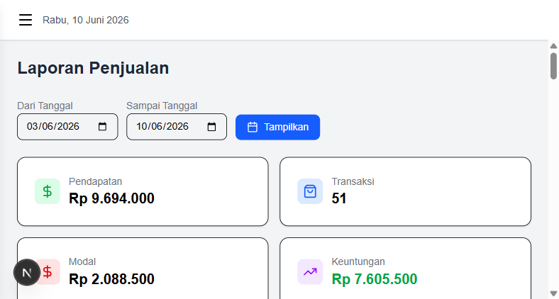

# El-Kasir - Panduan Lengkap Sistem Kasir

## Daftar Isi
1. [Tentang Proyek](#tentang-proyek)
2. [Tech Stack](#tech-stack)
3. [Persyaratan Sistem](#persyaratan-sistem)
4. [Instalasi](#instalasi)
5. [Struktur Proyek](#struktur-proyek)
6. [Database Schema](#database-schema)
7. [Fitur Utama](#fitur-utama)
8. [Panduan Penggunaan](#panduan-penggunaan)
9. [Deployment ke Vercel](#deployment-ke-vercel)
10. [Troubleshooting](#troubleshooting)

---

## Tentang Proyek

**El-Kasir** adalah sistem kasir (Point of Sale) modern berbasis web yang dibangun menggunakan Next.js, TypeScript, dan Prisma ORM dengan database SQLite. Sistem ini dirancang untuk membantu bisnis kecil dan menengah dalam mengelola penjualan, stok produk, dan laporan keuangan.

### Tujuan
- Menyediakan sistem kasir yang mudah digunakan
- Manajemen produk dan stok secara real-time
- Laporan penjualan dan keuntungan otomatis
- Dukungan multi-user dengan role-based access

---

## Tech Stack

| Teknologi | Versi | Fungsi |
|-----------|-------|--------|
| **Next.js** | 16.x | Framework React full-stack (App Router) |
| **TypeScript** | 5.x | Type-safe JavaScript |
| **React** | 19.x | Library UI |
| **Tailwind CSS** | 4.x | Utility-first CSS framework |
| **Prisma ORM** | 7.x | Database ORM dengan type-safety |
| **SQLite** | - | Database lokal (via better-sqlite3) |
| **NextAuth.js** | 4.x | Authentication (credentials-based) |
| **Recharts** | 3.x | Library chart untuk analytics |
| **Lucide React** | 1.x | Icon library |
| **bcryptjs** | 3.x | Password hashing |
| **date-fns** | 4.x | Date formatting utilities |

---

## Persyaratan Sistem

### Wajib
- **Node.js** >= 18.x (direkomendasikan 20.x+)
- **npm** >= 9.x
- **Git**

### Direkomendasikan
- RAM minimal 4GB
- Browser modern (Chrome, Firefox, Edge)
- Koneksi internet untuk instalasi package

---

## Instalasi

### Step 1: Clone / Buat Proyek

```bash
# Buat proyek Next.js baru
npx create-next-app@latest el-kasir \
  --typescript \
  --tailwind \
  --eslint \
  --app \
  --src-dir \
  --use-npm

# Masuk ke direktori proyek
cd el-kasir
```

### Step 2: Install Dependencies

```bash
# Dependencies utama
npm install prisma @prisma/client next-auth bcryptjs recharts lucide-react date-fns dotenv

# Adapter SQLite untuk Prisma v7
npm install better-sqlite3 @prisma/adapter-better-sqlite3

# Type definitions
npm install -D @types/bcryptjs @types/better-sqlite3 tsx
```

### Step 3: Inisialisasi Prisma

```bash
npx prisma init --datasource-provider sqlite
```

### Step 4: Konfigurasi Environment

Buat file `.env` di root proyek:

```env
# Database
DATABASE_URL="file:./dev.db"

# NextAuth
NEXTAUTH_SECRET="ganti-dengan-random-string-yang-panjang"
NEXTAUTH_URL="http://localhost:3000"
```

> **Penting:** Generate secret yang aman menggunakan:
> ```bash
> node -e "console.log(require('crypto').randomBytes(32).toString('hex'))"
> ```

### Step 5: Setup Database Schema

Edit file `prisma/schema.prisma` (lihat bagian [Database Schema](#database-schema)).

### Step 6: Migrasi Database

```bash
# Jalankan migrasi
npx prisma migrate dev --name init

# Generate Prisma Client
npx prisma generate
```

### Step 7: Seed Data Awal

Buat file `prisma/seed.ts` dan jalankan:

```bash
npx prisma db seed
```

### Step 8: Konfigurasi Tambahan

**`prisma.config.ts`:**
```typescript
import "dotenv/config";
import { defineConfig } from "prisma/config";

export default defineConfig({
  schema: "prisma/schema.prisma",
  migrations: {
    path: "prisma/migrations",
    seed: "npx tsx prisma/seed.ts",
  },
  datasource: {
    url: process.env["DATABASE_URL"],
  },
});
```

**`next.config.ts`:**
```typescript
import type { NextConfig } from "next";

const nextConfig: NextConfig = {
  serverExternalPackages: ["better-sqlite3", "@prisma/adapter-better-sqlite3"],
};

export default nextConfig;
```

**`package.json`** - tambahkan seed config:
```json
{
  "prisma": {
    "seed": "npx tsx prisma/seed.ts"
  }
}
```

### Step 9: Jalankan Development Server

```bash
npm run dev
```

Buka browser di `http://localhost:3000`

---

## Struktur Proyek

```
el-kasir/
├── prisma/
│   ├── schema.prisma          # Database schema
│   ├── seed.ts                # Data seeding
│   └── migrations/            # Migration files
├── public/
│   └── logo.svg               # Logo aplikasi
├── src/
│   ├── app/
│   │   ├── api/
│   │   │   ├── auth/[...nextauth]/route.ts   # NextAuth API
│   │   │   ├── products/route.ts             # CRUD Produk
│   │   │   ├── categories/route.ts           # CRUD Kategori
│   │   │   ├── transactions/route.ts         # Transaksi
│   │   │   ├── reports/route.ts              # Laporan
│   │   │   └── users/route.ts                # CRUD User
│   │   ├── dashboard/
│   │   │   ├── layout.tsx                    # Dashboard layout wrapper
│   │   │   ├── page.tsx                      # Dashboard utama
│   │   │   ├── pos/page.tsx                  # Halaman kasir/POS
│   │   │   ├── products/page.tsx             # Manajemen produk
│   │   │   ├── categories/page.tsx           # Manajemen kategori
│   │   │   ├── transactions/page.tsx         # Riwayat transaksi
│   │   │   ├── reports/page.tsx              # Laporan penjualan
│   │   │   └── users/page.tsx                # Manajemen user
│   │   ├── login/page.tsx                    # Halaman login
│   │   ├── layout.tsx                        # Root layout
│   │   ├── page.tsx                          # Redirect ke dashboard
│   │   ├── globals.css                       # Global styles
│   │   └── favicon.ico                       # Favicon
│   ├── components/
│   │   ├── Logo.tsx          # Komponen logo SVG
│   │   ├── Providers.tsx     # SessionProvider wrapper
│   │   └── Sidebar.tsx       # Sidebar navigasi
│   ├── lib/
│   │   ├── auth.ts           # NextAuth configuration
│   │   └── prisma.ts         # Prisma client singleton
│   ├── types/
│   │   └── next-auth.d.ts    # NextAuth type declarations
│   └── generated/
│       └── prisma/           # Generated Prisma client
├── .env                      # Environment variables
├── .env.example              # Template environment
├── next.config.ts            # Next.js config
├── prisma.config.ts          # Prisma config
├── tsconfig.json             # TypeScript config
└── package.json              # Dependencies & scripts
```

---

## Database Schema

### ERD (Entity Relationship Diagram)

```
┌──────────┐     ┌──────────────┐     ┌─────────────────┐
│   User   │     │   Category   │     │     Product     │
├──────────┤     ├──────────────┤     ├─────────────────┤
│ id       │     │ id           │     │ id              │
│ name     │     │ name         │     │ name            │
│ email    │     │ description  │     │ description     │
│ password │     │ createdAt    │     │ price           │
│ role     │     └──────┬───────┘     │ cost            │
│ createdAt│            │             │ stock           │
└────┬─────┘            │ 1:N         │ categoryId (FK) │
     │                  └────────────►│ isActive        │
     │                                │ createdAt       │
     │                                └────────┬────────┘
     │                                         │
     │ 1:N                                     │ 1:N
     │                                         │
     ▼                                         ▼
┌──────────────┐     ┌─────────────────────────────┐
│ Transaction  │     │      TransactionItem         │
├──────────────┤     ├─────────────────────────────┤
│ id           │     │ id                          │
│ transNumber  │     │ transactionId (FK)          │
│ totalAmount  │     │ productId (FK)              │
│ paymentAmount│     │ productName                 │
│ changeAmount │     │ quantity                    │
│ userId (FK)  │────►│ price                       │
│ createdAt    │ 1:N │ subtotal                    │
└──────────────┘     └─────────────────────────────┘
```

### Schema Prisma

```prisma
generator client {
  provider = "prisma-client"
  output   = "../src/generated/prisma"
}

datasource db {
  provider = "sqlite"
}

enum Role {
  ADMIN
  CASHIER
}

model User {
  id           String        @id @default(cuid())
  name         String
  email        String        @unique
  password     String
  role         Role          @default(CASHIER)
  createdAt    DateTime      @default(now())
  transactions Transaction[]
}

model Category {
  id          String    @id @default(cuid())
  name        String    @unique
  description String    @default("")
  products    Product[]
  createdAt   DateTime  @default(now())
}

model Product {
  id               String            @id @default(cuid())
  name             String
  description      String            @default("")
  price            Float
  cost             Float             @default(0)
  stock            Int               @default(0)
  categoryId       String
  category         Category          @relation(fields: [categoryId], references: [id])
  isActive         Boolean           @default(true)
  createdAt        DateTime          @default(now())
  transactionItems TransactionItem[]
}

model Transaction {
  id                String            @id @default(cuid())
  transactionNumber String            @unique
  totalAmount       Float
  paymentAmount     Float
  changeAmount      Float
  userId            String
  user              User              @relation(fields: [userId], references: [id])
  createdAt         DateTime          @default(now())
  items             TransactionItem[]
}

model TransactionItem {
  id            String      @id @default(cuid())
  transactionId String
  transaction   Transaction @relation(fields: [transactionId], references: [id], onDelete: Cascade)
  productId     String
  product       Product     @relation(fields: [productId], references: [id])
  productName   String
  quantity      Int
  price         Float
  subtotal      Float
}
```

---

## Fitur Utama

### 1. Dashboard Analytics



Dashboard lengkap dengan analisis penjualan mendalam:
- **KPI Cards**: Penjualan hari ini (dengan % perubahan vs kemarin), transaksi, penjualan bulanan, estimasi profit 30 hari
- **Tren Penjualan 30 Hari**: Area chart dengan toggle Pendapatan/Profit
- **Penjualan per Kategori**: Donut chart dengan persentase breakdown
- **Produk Terlaris**: Tabel top 10 produk dengan qty, revenue, profit, dan margin %
- **Distribusi Penjualan per Jam**: Bar chart penjualan per jam (06:00-22:00)
- **Transaksi Terbaru**: 5 transaksi terakhir dengan detail kasir dan item
- **Peringatan Stok Rendah**: Notifikasi produk dengan stok <=5

### 2. Authentication & Authorization



- Login dengan email dan password
- Password di-hash menggunakan bcrypt
- JWT session management via NextAuth.js
- Role-based access control:
  - **Admin**: Akses semua fitur termasuk manajemen user
  - **Kasir**: Akses POS, produk, dan transaksi sendiri

### 2. Dashboard
- Kartu ringkasan: penjualan hari ini, jumlah transaksi, total produk, stok rendah
- Grafik batang penjualan 7 hari terakhir (Recharts)
- Tabel produk terlaris
- Peringatan stok rendah

### 3. Kasir / POS (Point of Sale)



- Grid produk dengan pencarian dan filter kategori
- Keranjang belanja dengan kontrol kuantitas (+/-)
- Input pembayaran dengan format Rupiah otomatis (prefix "Rp")
- Kalkulasi kembalian otomatis
- Struk/receipt yang bisa dicetak
- Validasi stok real-time
- Auto-generate nomor transaksi (format: TRX YYYYMMDD-0001)

### 4. Manajemen Produk



- CRUD produk (Admin only)
- Filter berdasarkan kategori dan pencarian
- Tracking stok dengan peringatan stok rendah (<=5)
- Toggle aktif/nonaktif produk
- Harga jual dan harga modal untuk perhitungan keuntungan

### 5. Manajemen Kategori
- CRUD kategori (Admin only)
- Jumlah produk per kategori
- Relasi satu-ke-banyak dengan produk

### 6. Riwayat Transaksi



- Daftar semua transaksi dengan filter tanggal
- Detail transaksi: items, jumlah, kasir
- Nomor transaksi unik untuk tracking

### 7. Laporan Penjualan



- Filter berdasarkan rentang tanggal
- Ringkasan: total pendapatan, transaksi, modal, keuntungan
- Detail per transaksi
- Perhitungan keuntungan otomatis (pendapatan - modal)

### 8. Manajemen User (Admin Only)
- CRUD user
- Role assignment (Admin/Kasir)
- Reset password

### 9. Responsive Design
- Fully responsive di semua halaman
- Mobile: sidebar hamburger menu, card layout untuk tabel
- POS: floating cart button di mobile, slide-in cart overlay
- Dashboard: 2-column cards di mobile, 4-column di desktop

---

## Panduan Penggunaan

### Akun Demo

| Role | Email | Password |
|------|-------|----------|
| Admin | admin@elkasir.com | admin123 |
| Kasir | kasir@elkasir.com | kasir123 |

### Alur Kerja Kasir

1. **Login** → Masuk dengan akun kasir
2. **Buka POS** → Klik menu "Kasir / POS"
3. **Tambah Produk** → Klik produk untuk menambahkan ke keranjang
4. **Atur Jumlah** → Gunakan tombol +/- untuk mengubah kuantitas
5. **Bayar** → Masukkan jumlah bayar (format otomatis Rp)
6. **Checkout** → Klik tombol "Bayar"
7. **Cetak Struk** → Struk otomatis muncul, bisa dicetak

### Alur Kerja Admin

1. **Login** → Masuk dengan akun admin
2. **Setup Kategori** → Menu "Kategori" → Tambah kategori produk
3. **Tambah Produk** → Menu "Produk" → Input nama, harga, stok, kategori
4. **Monitor Dashboard** → Lihat ringkasan penjualan dan produk terlaris
5. **Cek Laporan** → Menu "Laporan" → Filter tanggal → Lihat keuntungan
6. **Kelola User** → Menu "Pengguna" → Tambah/edit/hapus kasir

---

## Deployment ke Vercel

### Catatan Penting

> ⚠️ **SQLite tidak bisa digunakan langsung di Vercel** karena environment serverless.
> Untuk production, ganti dengan **Turso** (cloud SQLite) atau database lain.

### Opsi 1: Menggunakan Turso (Cloud SQLite)

1. Daftar akun di [turso.tech](https://turso.tech)
2. Buat database baru:
   ```bash
   turso db create el-kasir
   turso db show el-kasir --url
   turso db tokens create el-kasir
   ```
3. Update `.env`:
   ```env
   DATABASE_URL="libsql://your-db-url"
   TURSO_TOKEN="your-token"
   ```
4. Install adapter Turso:
   ```bash
   npm install @prisma/adapter-libsql @libsql/client
   ```
5. Update `src/lib/prisma.ts` untuk menggunakan Turso adapter

### Opsi 2: Menggunakan Vercel Postgres

1. Aktifkan Vercel Postgres di dashboard Vercel
2. Install: `npm install @prisma/adapter-pg pg`
3. Update schema provider ke `postgresql`
4. Migrasi ulang

### Langkah Deploy

```bash
# Install Vercel CLI
npm install -g vercel

# Login ke Vercel
vercel login

# Deploy
vercel --prod
```

### Environment Variables di Vercel

Set di dashboard Vercel → Settings → Environment Variables:
- `DATABASE_URL`
- `NEXTAUTH_SECRET`
- `NEXTAUTH_URL` (URL production)

---

## Troubleshooting

### Error: "Cannot find module '@/generated/prisma'"

```bash
npx prisma generate
```

### Error: "Table does not exist"

```bash
npx prisma migrate dev --name init
npx prisma db seed
```

### Error: "PrismaClient needs adapter"

Pastikan `src/lib/prisma.ts` menggunakan adapter:
```typescript
import { PrismaBetterSqlite3 } from "@prisma/adapter-better-sqlite3"
const adapter = new PrismaBetterSqlite3({ url: `file:${dbPath}` })
const prisma = new PrismaClient({ adapter })
```

### Error: PowerShell Execution Policy

```powershell
Set-ExecutionPolicy -Scope Process -ExecutionPolicy Bypass
```

### Port 3000 Already in Use

```bash
npm run dev -- -p 3001
```

### Build Error saat Production

```bash
# Bersihkan cache dan rebuild
rm -rf .next node_modules
npm install
npx prisma generate
npm run build
```

---

## Scripts yang Tersedia

```bash
npm run dev       # Development server (localhost:3000)
npm run build     # Production build
npm run start     # Jalankan production server
npm run lint      # Jalankan ESLint

# Prisma commands
npx prisma studio           # Buka database GUI
npx prisma migrate dev      # Jalankan migrasi
npx prisma generate         # Generate Prisma client
npx prisma db seed          # Seed database
npx prisma db push          # Push schema ke database
```

---

## Lisensi

Proyek ini dibuat untuk keperluan pembelajaran dan bisa digunakan secara bebas.
